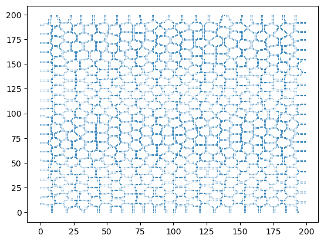

# Plotbd - Plot the boundaries of segmented objects

Given a list of annotated objects, plot the boundaries of the objects.

The objects need not be within a 2D-grid mesh, that is, they can be allocated
in random positions in the 2D-space, with coordinates x and y.

# Demo

Points:

->
Boundaries:

Notebook:
[demo.ipynb](./demo/demo.ipynb)
